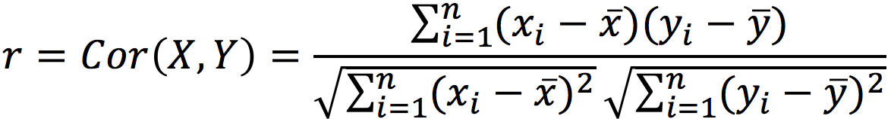
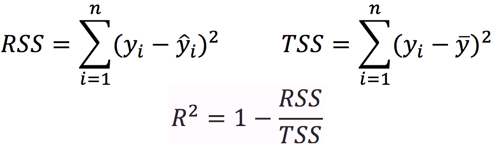

In graduate school, I worked on a project in which I used neural signals to predict the forelimb EMG signals in rats. I built a linear model and I reported my prediction accuracy in two forms: the *correlation coefficient* ***(r)*** and the *coefficient of determination* ***(R-squared or R^2^)***.

Unfortunately, I received some criticism from a committee member during my defense and also from a reviewer when I submitted my paper. They told me that ___there was no need to report both **r** and **R^2^**, because **R^2^** was simply the square of the **r**___. I searched this online and saw that almost everbody was saying the same thing: coefficent of determination is simply the squared correlation coefficient __(r^2^)__!

My motivation in using **r** and **R-square**, of course, was to evaluate the similarity between actual and predicted EMG signals. **r** generates a value between -1 and 1, and reflects if two signals ___covary___, meaning if they increase or decrease together. **r** doesn't care about the signal amplitudes, *i.e.* it isn't affected by the differences in the means. **R^2^** on the other hand, cares about the distances between points, and it can go to negative values pretty quickly (although most people believe that it ranges between 0 and 1 since it is a ratio and squared value!), if two signals have different means.

Obviously, there is a confusion. There are actually 3 different concepts here: 1.correlation coefficient (**r**) 2.squared correlation coefficient (**r^2^**) and 3. coefficient of determination (**R^2^**). And yes, sometimes **r^2^** and **R^2^** are the same thing, but sometimes they are not. I tried to clarify this in my mind by applying these concepts on a dataset. I would like to share my insights with you.

```{r setup, include=FALSE}
knitr::opts_chunk$set(echo = TRUE)
```

## When r^2^ is R^2^

I am going to use the **cars** data from the R library. There are 50 observations and 2 variables in this dataset that are the **speed** and **stopping distances** of cars. Here is a quick summary:

```{r cars}
summary(cars)
```


We already know that these are two different quantities with different measurement units, i.e. **mph** and **ft**. By examining the scatter plot, we see that these two variables are positively correlated:


```{r, echo=FALSE}
plot(cars, pch=16, col='blue', main="Stopping distance vs. Speed", 
  	xlab="Speed", ylab="Dist")
```

Remember that the correlation is a measure of the linear relationship between *X* and *Y*, and defined as:
<br><br>

```{r  out.width = "40%", echo=FALSE}
library(knitr)
 
```
<br><br>

where `x_bar` denotes the mean of variable `x`. Note that ***means are substracted*** to find the variances and the covarience. Now, lets recall the formulas used for computing the __R^2^__:
<br><br>

```{r  out.width = "40%", echo=FALSE}
library(knitr)
 
```
<br>
where RSS is the *Residual Sums of Squares*, TSS is the *Total Sums of Squares*, `y` is the obervations, `y_bar` denotes the observation mean, and `y_hat` is the predictions.
<br><br>

Let's use the `cor()` and `lm()` functions to compute the **r** and **R^2^**, respectively:

```{r, echo=TRUE, collapse=TRUE}
attach(cars)
r = cor(dist,speed)
lm.fit = lm(dist~speed)
R2 = summary(lm.fit)$r.squared
# Print results
cat("Correlation coefficient = ", r)
cat("Square of corr. coef. = ", r*r)
cat("Coefficient of determination= ", R2)
```
<b><b>

As you can see, **r^2^** and **R^2^** are exactly the same thing! We took the advantage of linear model object to fetch the R^2^, but we can verify the result using the formula:

```{r echo=TRUE, collapse=TRUE}
y = dist
y_hat = fitted.values(lm.fit)
y_bar = mean(y)
RSS = sum((y-y_hat)^2)
TSS = sum((y-y_bar)^2)
R2 = 1 - RSS/TSS
cat("Coefficient of determination= ", R2)
```
<b><b>

Our goal here was to measure the similarity between the variables *x* (speed) and *y* (dist), and we did that in two ways: First, finding the correlation between *x* and *y* and second, by modelling the linear relationship between *x* and *y*. We conclude that __r^2^ = R^2^__ holds for simple linear regression and when the intercept term is included. By the way, this can not be generalized to Multiple Linear Regression (please see [An Intoruction to Statistical Learning](http://www-bcf.usc.edu/~gareth/ISL/) for more).

## When r^2^ is not R^2^

### 1. There is no constant term (intercept)

Now, let's exclude the intercept term and see what happens. Below is a picture of fitted lines with and without the intercept term:

```{r, echo=FALSE, out.width="50%"}
lm.fit2 = lm(dist ~ speed -1)
plot(speed,dist,pch=16,col='blue',xlim=c(0, 30))
abline(lm.fit,col='red')
abline(lm.fit2,col='black')
legend("topleft", legend=c("with intercept","no intercept"), col=c("red","black"), lty=1:1)
```

Let's take a look at the **R^2^** one more time:
```{r, echo=TRUE, collapse=TRUE}
lm.fit2 = lm(dist ~ speed -1) # Linear fit without intercept
R2 = summary(lm.fit2)$r.squared
cat("Coefficient of determination= ", R2)
```
It is different, and it is overestimated. Why? You can look [here](https://stackoverflow.com/questions/20333600/why-does-summary-overestimate-the-r-squared-with-a-no-intercept-model-formula) for a detailed discussion, but in simple terms, when intercept is excluded, the algorithm considers the observation mean (y_bar) as 0, and thus the TSS term becomes larger leading to an increase in the **R^2^** value.

### 2. You want to *explain* a variable using a second variable

Now, we are going to look at the same data from a different perspective.

I am going to use the same ___dist___ and ___speed___ variables, but in a hypothetical setting. Let's assume that I have bunch of other drivers and attibutes of those drivers. I built a model that takes driver attibutes as inputs and produces the time that driver spent in traffic as the output. I tested my model on a test set (50 cars) and recorded the predicted output (*y_hat*). I already know the actual output (*y*). Now, I want to evaluate the performance of my model. Coincidentally(!), the *y* and *dist* values are the same, just as the *y_hat* and *speed* values are the same.

Let me repeat this in a different way: Input x (speed) and output y (dist) values with different unit measures (mph vs. ft) are no more! Instead, I have one *actual signal* and one *predicted signal* which happen to have the same values as dist and speed, respectively. But, we will pretend that they both have the same unit (let's assume that it is *minute*).

```{r}
y <- dist
y_hat <- speed
```
<b><b>

As the performance criteria, I decided to report the similarity between the actual signal and predicted signal. Which one should I pick, __r__ or __R^2^__?

If we plot them on the same graph, we will see that they are quiet different. Notice that x-axis is just the sample number:

```{r}
x=1:50
plot(x, y, type="b", pch=19, col="red", xlab="sample no", ylab="time (min)")
lines(x, y_hat, type="b", pch=19, col="blue")
legend(1, 110, legend=c("actual", "predicted"), col=c("red", "blue"), lty=1:1)
```

```{r echo=TRUE, collapse=TRUE}
y_bar = mean(y)
RSS = sum((y-y_hat)^2)
TSS = sum((y-y_bar)^2)
R2 = 1 - RSS/TSS
cat("Coefficient of determination= ", R2)
```
<b><b>

As these two signals become more seperated, the R^2^ value will decrease while the R value will stay the same. Let's look at this in a picture form:

```{r echo=FALSE}
findR2 <- function(y, y_hat){
y_bar = mean(y)
RSS = sum((y-y_hat)^2)
TSS = sum((y-y_bar)^2)
R2 = 1 - RSS/TSS
return(R2)
}

r = 0
R2 = 0
for (i in c(1:20)){
  r[i] = cor(y,y_hat)
  R2[i] = findR2(y, y_hat)
  y_hat = y_hat - 10
}

par(mfrow=c(1,2)) 
plot(r, ylab = 'r', xlab = 'distance between means ->')
plot(R2, ylab = 'R2', xlab = 'distance between means ->')
```

R^2^ gives us a measure on how much of the variation in independent variable ___y___ can be explained by the dependent variable ___y_hat___. By switching their their roles, we change the RSS/TSS term, thus we obtain a different R^2^ value.

```{r, collapse=TRUE}
y <- speed
y_hat <- dist
y_bar = mean(y)
RSS = sum((y-y_hat)^2)
TSS = sum((y-y_bar)^2)
R2 = 1 - RSS/TSS
cat("Coefficient of determination= ", R2)
```

To put the above phenomena into a context, let's say that we built a model using the training data we have. But, in actuality, the features are not capable of establishing a linear relationship to the output, and it turned out that our model did a terrible job in making predictions from unseen data. Let's say the model produced a prediction that is hugely diverted from the true values. In theory, we can still have a moderate correlation between predicted and actual signals, however, __R^2^__ will generate a very small or negative value depending on the differences in their means.

### 3. Conclusion

a. If we use Linear Regression to assess the similarity between `x` and `y`, the algorithm will use `y` and fitted values `(beta0 + X*beta1)` to compute the *R^2^*. In that case, the the squared correlation and *R^2^* will be the same.

b. If we have two seperate variables (*e.g.* actual signal vs. the model output) and we want to compare them, we should avoid using Linear Regression function 
`lm()` just becuase it automaticaly reports the __R^2^__. We are not interested in fitting two variables, but we want to know if our prediction is close to the actual data or not. In that case, we should directly implement the __R^2^__ formula.
